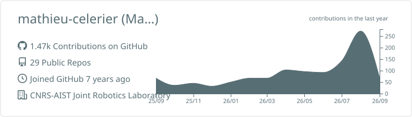
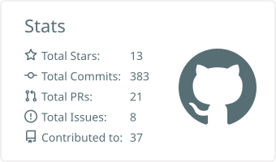
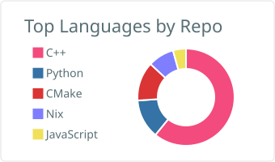
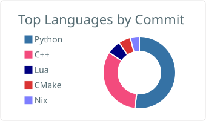

<h1 align="center">Hi, I'm Mathieu Celerier 👋</h1>

  Roboticist working on physical human–robot interaction (pHRI) and torque-controlled manipulators
   
  <a href="https://jrl.cnrs.fr">CNRS-AIST Joint Robotics Laboratory (JRL), IRL 3218</a> · AIST, Japan

  
  
  

---

### 🔭 About

I'm a robotics researcher focused on the intersection of control theory, human motion modeling, and
experimental robotics — with an emphasis on safety, stability, and user experience during sustained
physical human-robot interaction.

- 🎓 Defended my PhD thesis in Dec 2025 at the CNRS-AIST Joint Robotics Laboratory
- 📄 Co-authored *"Demonstrating a Control Framework for Physical Human-Robot Interaction Toward
  Industrial Applications"*, presented at [RSS 2025](https://roboticsconference.org)
- 🔬 Working with torque-controlled manipulators (Kinova arms), inverse-dynamics QP control, and the
  [mc_rtc](https://jrl-umi3218.github.io/mc_rtc/) whole-body control framework
- 🌱 Currently exploring human motion models and their limits for control and generation
- 💬 Ask me about pHRI, compliant/explicit-compliance control, or shared control for manipulators

### 🛠️ Tools & Stack

  
  
  
  
  
  
  

### 📊 GitHub Stats

  
  

  
  

Generated daily by a <a href="./.github/workflows/profile-summary-cards.yml">GitHub Action</a> using <a href="https://github.com/vn7n24fzkq/github-profile-summary-cards">github-profile-summary-cards</a> and committed straight into this repo — no live third-party rendering involved. Cards appear after the workflow's first run (Actions tab, or wait for the daily schedule).

---

<i>📫 Reach me at mathieu.celerier.ing@gmail.com</i>

